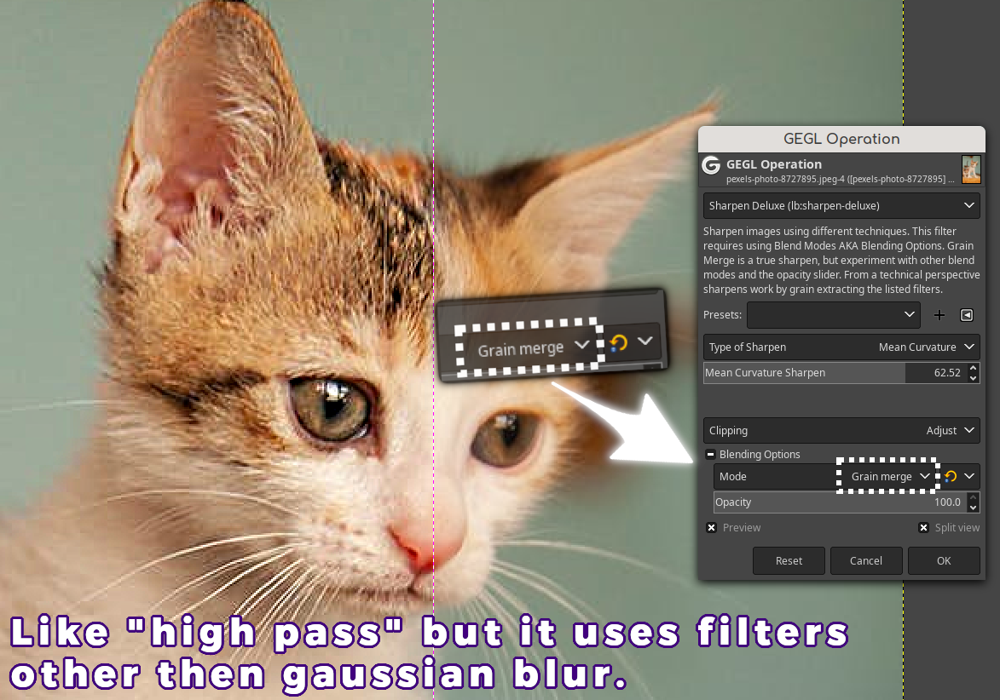
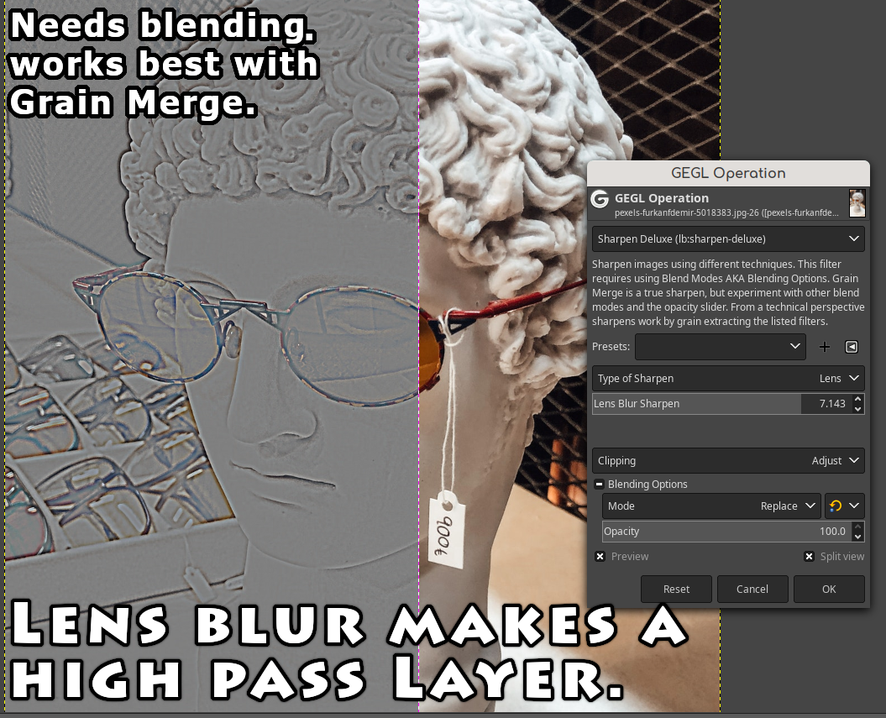
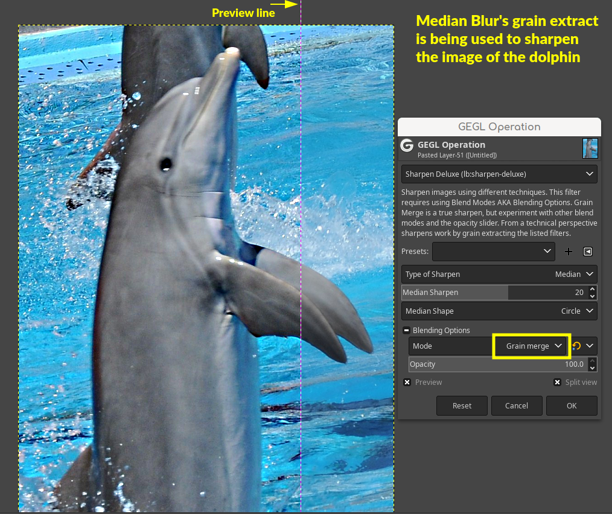
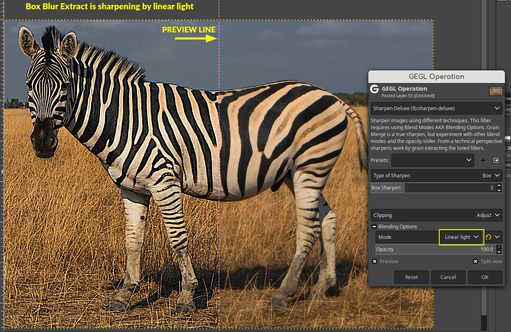

## Sharpen Deluxe a new Gimp Plugin to sharpen images (by generating a high pass mask)

This is a Gimp GEGL plugin, it expects the user to use Gimp's built in Blending Options, also known as blend modes.
 All GEGL filters in Gimp have "blending options" with a long list of all Gimps blend modes. If you don't use
that then it will just create a "high pass layer". which is a grayscale-ish layer can be stacked above and manually
 blended using Gimp's layers.





After you install, restart Gimp and go to GEGL operations and look for "Sharpen Deluxe". If you are using Gimp 
2.99.16 you will see this filter under Filters>Enhance.

To explain this filter a bit more technically. The following filters listed.

**Median Blur**

**DCT Denoise**

**Box Blur**

**Mean Curvature Blur**

**Domain Transform Smooth**

**Noise Reduction**

**Lens Blur**

**Gaussian Blur**

are all individually being grain extracted to create a high pass. 
Gimp's grain extract blend mode gives you the high pass layer and 
you do what you want with the high pass layer from there. 

## Location to put Binaries
(THEY DO NOT GO IN THE NORMAL PLUGINS FOLDER)

**Windows**
 C:\Users\(USERNAME)\AppData\Local\gegl-0.4\plug-ins
 
**Linux**
 /home/(USERNAME)/.local/share/gegl-0.4/plug-ins

**Linux (Flatpak includes Chromebook)**
 /home/(USERNAME)/.var/app/org.gimp.GIMP/data/gegl-0.4/plug-ins

## Compiling and Installing

### Linux

To compile and install you will need the GEGL header files (`libgegl-dev` on
Debian based distributions or `gegl` on Arch Linux) and meson (`meson` on
most distributions).

```bash
meson setup --buildtype=release build
ninja -C build

```
### Windows

The easiest way to compile this project on Windows is by using msys2.  Download
and install it from here: https://www.msys2.org/

Open a msys2 terminal with `C:\msys64\mingw64.exe`.  Run the following to
install required build dependencies:

```bash
pacman --noconfirm -S base-devel mingw-w64-x86_64-toolchain mingw-w64-x86_64-meson mingw-w64-x86_64-gegl
```

Then build the same way you would on Linux:

```bash
meson setup --buildtype=release build
ninja -C build

```


## More previews of this based Gimp plugin






